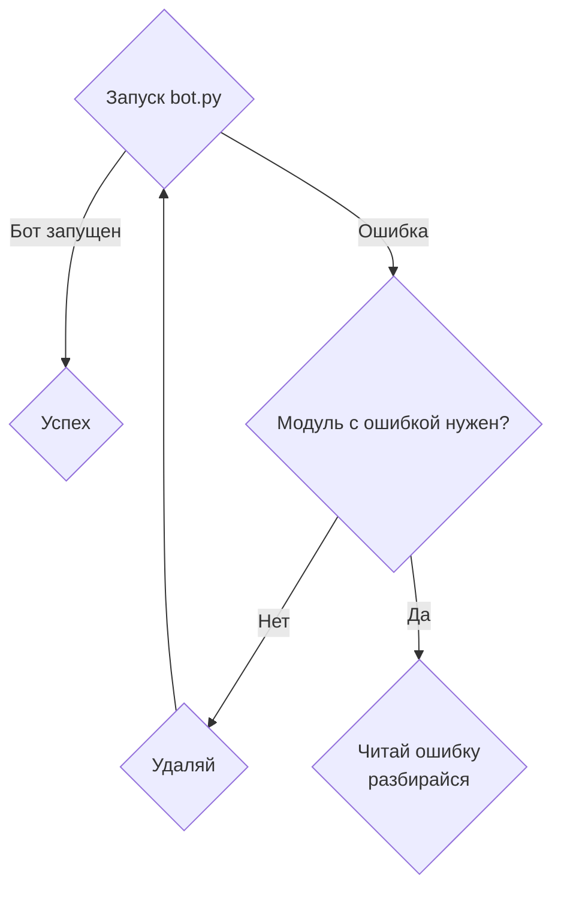

# Samuro Bot for Heroes of the Storm

**[Пригласить на свой discord сервер](https://discord.com/oauth2/authorize?client_id=664368184790614016&permissions=137707703313&scope=applications.commands%20bot)**

## Автор

 **[fennr (@fennr)](fennr.github.io/)**
 
 [Дискорд](https://discord.gg/2RD32kFEk8)
 
## Описание


Бот обладает обширной библиотекой функций, связанных с игрой *Heroes of the Storm*;

Также присутствует несколько функций для discord-комьюнити, написанных специально под ряд серверов;

При необходимости можно добавлять или удалять отдельные модули из **cogs** не затрагивая остальной функционал

## Первый запуск

### Подготовка

* Установить зависимости (желательно в venv)
```bash
pip install -r requirements.txt
```
* Подготовить БД создав нужные таблицы через скрипт [sql.init](utils/scripts/init.sql);

Скрипт написан под *PostgreSQL*, корректность для других БД не проверялась

* Зарегистрировать бота на сайте [Discord Developers](https://canary.discord.com/developers/applications)
    * Для работы потребуется *APPLICATION ID* и *TOKEN*
    * Настройку *Bot Permissions* и *Privileged Gateway Intents* расписывать не буду, они зависят от нужных модулей

* Подготовить для себя [config](config.yaml):
    * Поставить нужный префикс
    * Поставить нужных админов
    * Выбрать цвета сообщений

### Запуск

* Установить переменные среды *APP_ID* и *TOKEN* или напрямую вставить значения в [bot.py](bot.py)
```py
TOKEN = os.environ.get('TOKEN')
APP_ID = os.environ.get('APP_ID')
```
* Запустить файл [bot.py](bot.py)

### Запуск в Docker контейнере

* Записать переменные в файл .env в корневой папке
```.env
TOKEN=123456
APP_ID=12345
YT_API=12345
```

* Запустить
```shell script
docker run --env-file=.env fenrir1121/samuro-bot
```

## COGs

### Игровые

* [heroes](cogs/heroes.py) - Модуль выдает основую информацию по всем героям
* [hots](cogs/hots.py) - Все команды связанные с хотсом, помимо информации о героях

Основые модули из-за которых бот изначально писался. Требуют минимум доп библиотек.

### Сообщество 

* [profile](cogs/profile.py) - Связка профилей в дискорде с батлнете. Основа для следующих модулей
* [event](cogs/event.py) - Проведение событий
* [team](cogs/team.py) - Объединения людей в команды/кланы
* [achievement](cogs/achievement.py) - Присвоение и вывод достижений
* [stats](cogs/stats.py) - Вывод статистики по людям, событиям, достижениям
* [fix](cogs/fix.py) - Фиксы различных данных в таблицах. Требовался при пересмотре логики некоторых функций.
Код некоторых функций может не работать, т.к они писались для разового использования.

Данный раздел требует для работы отдельную Базу данных.

### RU | Heroes of the Storm

* [news](cogs/news.py) - Создание новостей и рассписания для сообщенства *RU | Heroes of the Storm*
* [ruhots](cogs/guilds.py) - Доп функции для RUHotS: лайки и вывод Артов от художников

Модули отделены от основной кодовой базы, содержат много хардкода и специфичных моментов.
Возможно когда-нибудь я вернусь к этим функциям, в их текущем состоянии рекомендую их к удалению.

### Технические

* [help](cogs/help.py) - Хелп по командам, выводит справку по каждому отдельному модулю
* [CommandErrorHandler](cogs/CommandErrorHandler.py) - Обработчик особых ситуаций. Вынесен отдельно т.к используется много своих обработок исключений
* [owner](cogs/owner.py) - Ряд технических команд доступных только создателю бота (в данный момент не доработан)
* [general](cogs/general.py) - Базовые команды: проверка жив ли бот, приглашение бота, информация о боте
* [slash](cogs/slash.py) - Создание команд с подсказками через слеш

Слеш команды обладают несколькими особенностями.
Именно из-за них во многих местах используется получение guild_id и author_id,
т.к эти атрибуты именуются не так, как в стандартной библиотеке дискорда.
Обычно для слеша команды пишут отдельно, но я ленив и старался писать так, чтобы они работали сразу и там и там.

### Прочие файлы для настройки

* [Константы](utils/classes/Const.py) - Различные пути к файлам и используемые в коде константы
* [Исключения](utils/exceptions) - Дополнительные исключения
* [Проверки](utils/check.py) - Различные проверки для разграничения доступа к функциям
* [Скрипты](utils/scripts) - Частично не нужные или даже не работающие скрипты с тестами различных функций


## Patch Updates

Обновление осуществляется в полуавтоматическом режиме, поскольку обновление файлов в репозитории **[heroesdata](https://github.com/HeroesToolChest/heroes-data/tree/master/heroesdata)** осуществляется с задержкой.

Перед обновлением проверить, что мейнтейнер выложил новые файлы под текущий патч.

### Обновление до актуального патча
* Обновить в [config](config.yaml) номер текущего патча
* Запустить [download_gamestrings](utils/scripts/download_gamestrings.py)

## Алгоритм решения проблем



## To Do 1.x

- [ ] Разгрести папку utils/hots
    - [ ] Или дополнить ее и вынести туда функции из других модулей
    - [ ] Или объединить файлы перенести в utils/library
- [ ] Протестировать **sqlalchemy**
- [ ] Добавить тесты кода
- [ ] Добавить исключения в сомнительных местах
- [ ] Добавить больше комментариев
- [ ] Переписать *create_heroes_ru_data* и все встреонные функции
- [ ] Попробовать собрать docker образ

## License

This project is licensed under the Apache License 2.0 - see the [LICENSE.md](LICENSE.md) file for details
